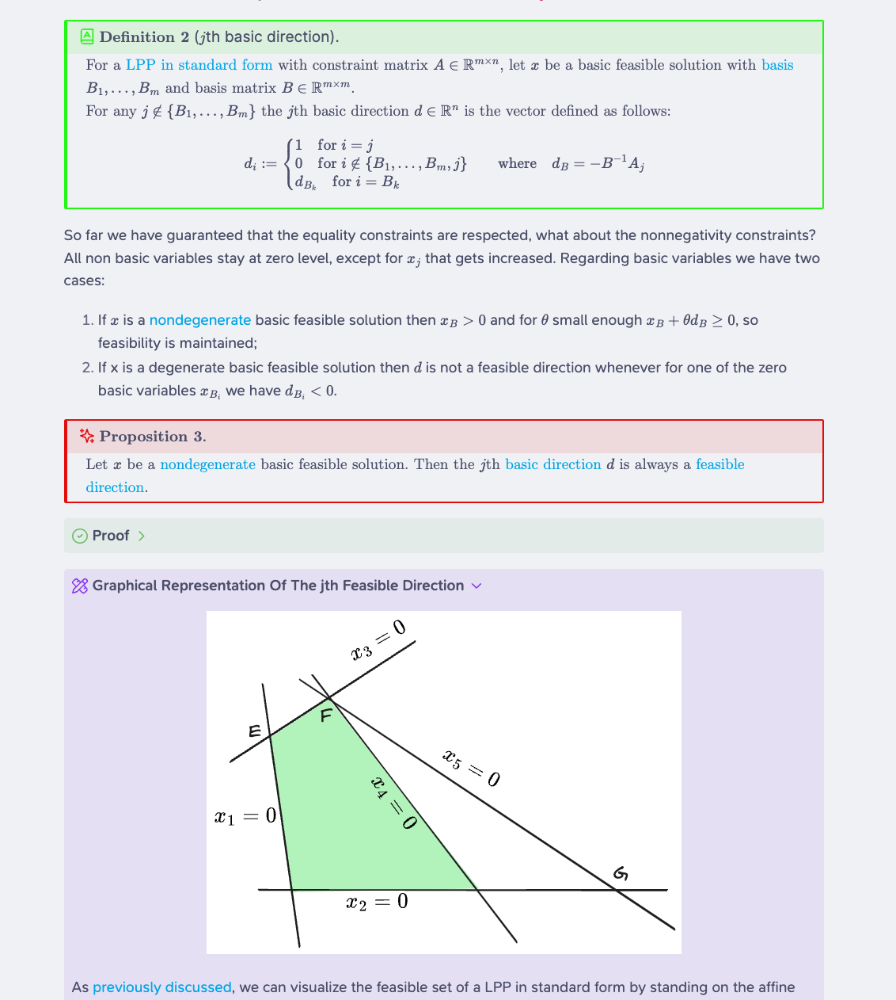

# Linear Programming Notes
This repository features Obsidian-markdown notes that thoroughly dissect the study of linear programming. From its geometric principles to the intricacies of the simplex method, these notes provide an exhaustive review on the topic. Illustrated with practical examples and intuitions, it's my aim to provide you with an all-inclusive and readily comprehensible resource that unravels the details of this fascinating subject.

The notes have been written with Obsidian, with the purpose of exploring its capabilities to enhance learning. Extensive backlinks are deployed to streamline understanding and recall essential concept during explanations and proofs.

These notes are comprehensive yet designed with the goal of serving as a readily accessible reference. Hence, proofs, intuitions, and examples are usually nested within callouts while major theorems and results are accentuated in specially styled "boxes". This design approach facilitates swift identification of relevant content without sacrificing the opportunity to delve into comprehensive details should you wish to do so. 



## How To Read These Notes
To read these notes you will need to:
1) [Download Obsidian](https://obsidian.md/) and install it (Don't worry! It's free and  very lightweight!)
2) Use this command to copy the repository: 
	```bash 
	git clone https://github.com/solbiax/LinearProgrammingNotes.git 
	``` 
3) Open Obsidian and in it, open the cloned repo folder as a vault. 
4) Obsidian will set up some plugins automatically once you open the vault. You might need to restart the app to make sure everything works. 
5) (Optional) Install the [SN Pro font](https://supernotes.app/open-source/sn-pro/).
6) Start reading! 

Due to Obsidian’s unstructured nature, understanding how to read my notes might seem daunting. If you don't know where to start, use the [[Linear Programming Master Note]] as an initial reference for navigation. 
Also, at the top of every note, there are helpful things like tags and brief summaries. You'll also notice a `next` and `prev` properties that will link the next and previous note for easy navigation.

## Credits
These notes draw significant inspiration from the book "[Introduction To Linear Optimization](https://www.amazon.com/Introduction-Linear-Optimization-Scientific-Computation/dp/1886529191/ref=sr_1_1?crid=2O1KP89Q1ZT0E&dib=eyJ2IjoiMSJ9.9G6zqPZ74XhzaWDJlGigr4UJSHLQKqX8_2oypaYQAehGEVBO9LU-La2Rh2SzxSvt8ELNUCjnSghTn1vMQ34-GjYhUKTSvIROVVe4vzBUwTlQ55INeqj3doOCOxCppCVO7MqBOxQpkdFYo1VY_Z9wlAsyoCYGizLGlcRgjM7TzJqxtTmt5xB0L-tVqPPIrYjZ2rVD4oHbS-FRqYg-wiqUMK4VxGfhdOCu2UL5J42ia2g.2Qvm2t25-pna9fOZ99y4nCSU1daU0x9OPkquR3gyZnE&dib_tag=se&keywords=introduction+to+linear+programming&qid=1715372574&sprefix=introduction+to+linear+programming%2Caps%2C192&sr=8-1)" by D. Bertsimas and J.N Tsitsiklis. If you like my notes and would like to delve more into the subject, please check the book out and buy it to support the authors.

If you've found value in these notes and wish to show your appreciation for the effort put into creating them, please consider giving this repository a star!